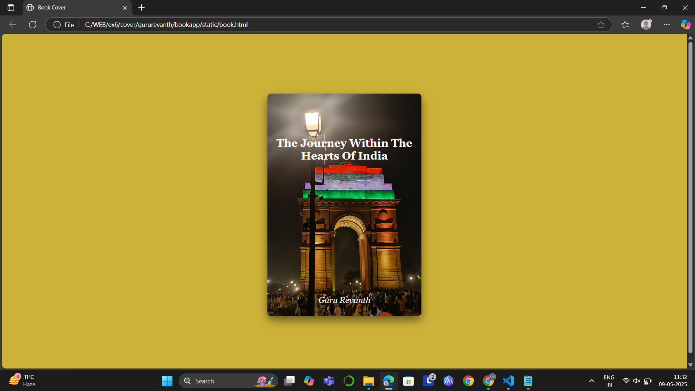

# Ex.06 Book Front Cover Page Design
## Date: 15-05-2025

## AIM:
To design a book front cover page using HTML and CSS.

## DESIGN STEPS:

### Step 1:
Create a Django Admin project.

### Step 2:
Create an app in the Django interface.

### Step 3:
Create a folder named 'static' in the app folder.

### Step 4:
Create a new HTML file in the static folder.

### Step 5:
Write the HTML code with relevant CSS properties.

### Step 6:
Choose the appropriate style and color scheme.

### Step 7:
Insert the images in their appropriate places.

### Step 8:
Publish the website in the LocalHost.

## PROGRAM:
```
<!DOCTYPE html>
<html lang="en">
<head>
  <meta charset="UTF-8">
  <title>Book Cover</title>
  <style>
    body {
      background: #cdb239;
      font-family: 'Georgia', serif;
      display: flex;
      justify-content: center;
      align-items: center;
      height: 100vh;
    }

    .book-cover {
      width: 300px;
      background-image: url('ingate.jpg');
      height: 450px;
      background-position: center;
  background-repeat: no-repeat;
  background-size: cover;
      color: rgb(255, 255, 255);
      padding: 20px;
      box-shadow: 0 10px 20px rgba(0,0,0,0.5);
      display: flex;
      flex-direction: column;
      justify-content: space-between;
      text-align: center;
      border-radius: 8px;
    }

    .book-title {
      font-size: 24px;
      font-weight: bold;
      margin-top: 75px;
    }

    .author-name {
      font-size: 18px;
      font-style: italic;
      margin-bottom: 5px;
    }
  </style>
</head>
<body>
  <div class="book-cover">
    <div class="book-title">The Journey Within The Hearts Of India</div>
    <div class="author-name">Guru Revanth</div>
  </div>
</body>
</html>

```

## OUTPUT:


## RESULT:
The program for designing book front cover page using HTML and CSS is completed successfully.
